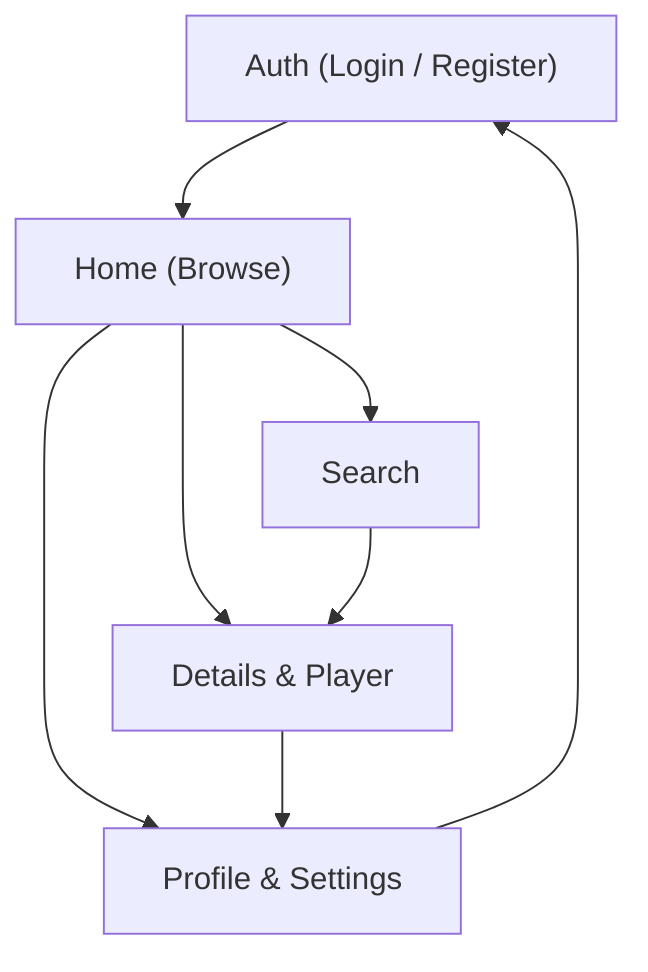

## 1. Product Overview
KLYX is a desktop-first IPTV streaming web app for watching Movies, Series, and Live TV in one place.
It provides secure accounts, protected playback, fast search, and a reliable HTML5/HLS player.

## 2. Core Features

### 2.1 User Roles
| Role | Registration Method | Core Permissions |
|------|---------------------|------------------|
| User | Email + password | Can browse catalog, search, play streams, manage profile and settings |

### 2.2 Feature Module
Our KLYX IPTV app requirements consist of the following main pages:
1. **Auth (Login / Register)**: create account, sign in, persist session.
2. **Home (Browse)**: Movies/Series/Live entry points, featured rails, basic navigation.
3. **Details & Player**: title/channel details, stream playback via HTML5/HLS, continue watching.
4. **Search**: global search across Movies/Series/Live, results list.
5. **Profile & Settings**: profile view, password change, preferences, logout.

### 2.3 Page Details
| Page Name | Module Name | Feature description |
|-----------|-------------|---------------------|
| Auth (Login / Register) | Registration | Create account with email + password and validate required fields |
| Auth (Login / Register) | Login | Authenticate user and store session (JWT) for protected pages |
| Auth (Login / Register) | Session handling | Keep user signed in across refresh; redirect authenticated users away from auth screens |
| Home (Browse) | Protected access | Block unauthenticated access; redirect to Login when session is missing/expired |
| Home (Browse) | Top navigation | Navigate between Movies, Series, Live, Search, Profile/Settings |
| Home (Browse) | Content discovery | Display curated rails/lists for Movies and Series; show Live section entry |
| Home (Browse) | Content lists | Open a Movie/Series/Channel details page from a card/tile |
| Details & Player | Details header | Show poster/thumbnail, title, type (movie/series/live), and short metadata |
| Details & Player | Stream playback | Play selected stream using HTML5 video with HLS support; show loading/error states |
| Details & Player | Series structure | For series, list seasons/episodes and start playback for selected episode |
| Details & Player | Live viewing | For live channels, support “Watch Live” start and a live indicator |
| Details & Player | Continue watching | Persist last position for movies/episodes and resume from last timestamp |
| Search | Search input | Search by title and keywords across Movies/Series/Live |
| Search | Results list | Display results grouped or filterable by content type; open details/player |
| Profile & Settings | Profile | Display user profile basics (email, display name) and allow editing display name |
| Profile & Settings | Security | Change password (current + new) and re-authenticate if needed |
| Profile & Settings | Preferences | Set playback preferences (e.g., autoplay next episode on/off) |
| Profile & Settings | Logout | End session and return to Login |

## 3. Core Process
User Flow:
1. Register (or Login) with email and password.
2. After login, land on Home (Browse) and choose Movies, Series, or Live.
3. Open a title/channel to view details and start playback.
4. For series, select season/episode and play; resume from last watched position.
5. Use Search to quickly find titles/channels and open details.
6. Manage Profile & Settings (display name, password, preferences) and Logout.

