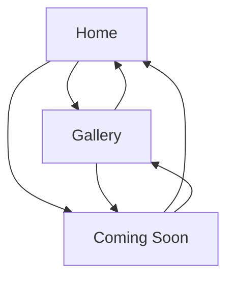

## 1. Product Overview
Klyx official marketing website to present the app, highlight key features, and showcase screenshots.
It provides clear CTAs and placeholders for future Login and Download experiences.

## 2. Core Features

### 2.2 Feature Module
Our marketing website requirements consist of the following main pages:
1. **Home**: app presentation (hero + value prop), features overview, screenshots preview, FAQ, footer with placeholder CTAs.
2. **Gallery**: full screenshots gallery with simple filtering and lightbox viewing.
3. **Coming Soon**: placeholder page for future **Login** and **Download** entry points.

### 2.3 Page Details
| Page Name | Module Name | Feature description |
|-----------|-------------|---------------------|
| Home | Top navigation | Navigate to Home sections, Gallery, and placeholder CTAs for Login/Download. |
| Home | Hero / App presentation | Explain what Klyx is in one sentence; provide primary CTA buttons (Login, Download) routed to placeholders. |
| Home | Features overview | Present key feature list (title + short description) in scannable cards. |
| Home | Screenshots preview | Show a small curated set of screenshots; link to Gallery page. |
| Home | Social proof (optional copy-only) | Display placeholder space for testimonials/press quotes (no submission). |
| Home | FAQ | Answer a short set of common questions about Klyx. |
| Home | Footer | Show company/legal placeholder links and repeated CTAs for Login/Download. |
| Gallery | Gallery grid | Browse screenshots in a responsive grid with captions. |
| Gallery | Filter (lightweight) | Filter screenshots by category (e.g., Onboarding, Core, Settings) using client-side toggle chips. |
| Gallery | Lightbox viewer | Open screenshot in overlay; navigate next/previous; close to return to grid. |
| Coming Soon | Intent message | Display "Login coming soon" or "Download coming soon" based on intent. |
| Coming Soon | Return actions | Provide links back to Home and Gallery. |

## 3. Core Process
- Visitor Flow: You land on Home, scan the hero and features, preview screenshots, then open the full Gallery for details. When you click Login or Download, you are taken to a Coming Soon page explaining the feature is not available yet and offering navigation back.

