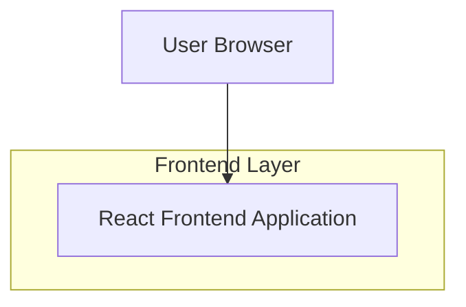

## 1.Architecture design

## 2.Technology Description
- Frontend: React@18 + vite + tailwindcss@3
- Backend: None

## 3.Route definitions
| Route | Purpose |
|-------|---------|
| / | Home page: app presentation, features, screenshots preview, placeholder CTAs |
| /gallery | Screenshots gallery: grid, filter chips, lightbox viewer |
| /coming-soon | Placeholder page for future login/download (supports query `?intent=login` or `?intent=download`) |

## 6.Data model(if applicable)
Not applicable (static marketing content only).