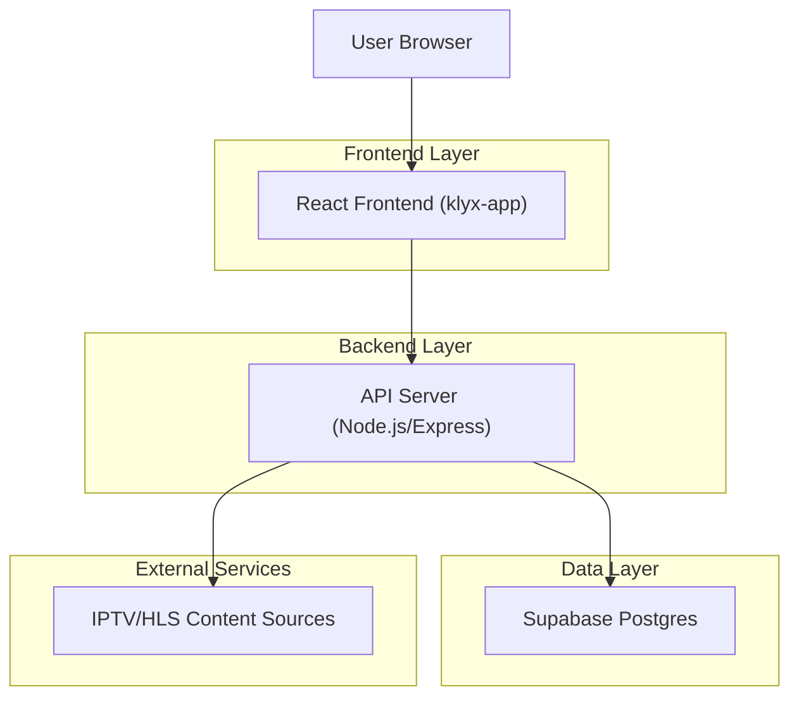
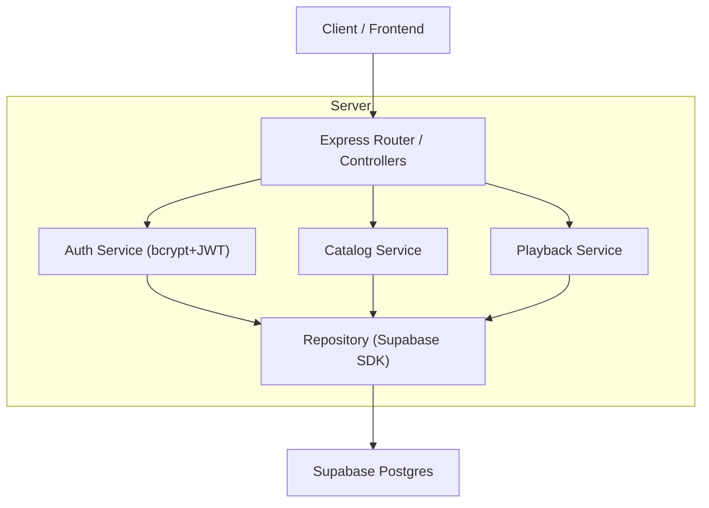
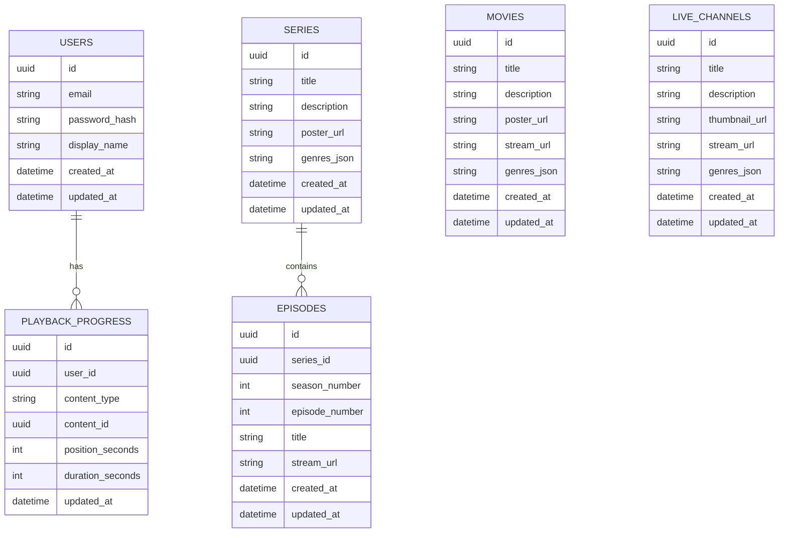

## 1.Architecture design


## 2.Technology Description
- Frontend: React@18 + react-router-dom + TypeScript + vite + hls.js (HLS playback)
- Backend: Node.js + Express@4 + bcrypt (password hashing) + jsonwebtoken (JWT)
- Database: Supabase (PostgreSQL)

## 3.Route definitions
| Route | Purpose |
|-------|---------|
| /login | Login screen; create session and redirect to app |
| /register | Registration screen |
| / | Protected home/browse hub (movies/series/live entry) |
| /details/:type/:id | Protected details page (movie/series/live) |
| /play/:type/:id | Protected playback surface (movie/episode/channel) |
| /search | Protected search page |
| /account | Protected profile & settings |

## 4.API definitions (If it includes backend services)
### 4.1 Core API
Auth
```
POST /api/auth/register
POST /api/auth/login
POST /api/auth/logout
GET  /api/auth/me
POST /api/auth/password
POST /api/auth/refresh
```
Catalog & Playback
```
GET /api/catalog/home
GET /api/catalog/movies/:id
GET /api/catalog/series/:id
GET /api/catalog/series/:id/episodes
GET /api/catalog/live/:id
GET /api/search?q=
POST /api/playback/progress
GET  /api/playback/progress?content_type=&content_id=
```

Shared TypeScript types (frontend + backend)
```ts
type ContentType = 'movie' | 'series' | 'live' | 'episode';

type User = {
  id: string;
  email: string;
  displayName: string | null;
  createdAt: string;
};

type AuthTokens = {
  accessToken: string; // JWT
  refreshToken: string; // opaque or JWT (server-validated)
  expiresIn: number;
};

type CatalogItem = {
  id: string;
  type: Exclude<ContentType, 'episode'>;
  title: string;
  posterUrl: string | null;
  description: string | null;
  genres: string[];
};

type Episode = {
  id: string;
  seriesId: string;
  seasonNumber: number;
  episodeNumber: number;
  title: string;
  streamUrl: string;
};

type PlaybackProgress = {
  userId: string;
  contentType: ContentType;
  contentId: string;
  positionSeconds: number;
  durationSeconds: number;
  updatedAt: string;
};
```

## 5.Server architecture diagram (If it includes backend services)


## 6.Data model(if applicable)
### 6.1 Data model definition


### 6.2 Data Definition Language
Users (users)
```
CREATE TABLE users (
  id UUID PRIMARY KEY DEFAULT gen_random_uuid(),
  email VARCHAR(255) UNIQUE NOT NULL,
  password_hash VARCHAR(255) NOT NULL,
  display_name VARCHAR(100),
  created_at TIMESTAMPTZ DEFAULT NOW(),
  updated_at TIMESTAMPTZ DEFAULT NOW()
);

GRANT SELECT ON users TO anon;
GRANT ALL PRIVILEGES ON users TO authenticated;
```

Catalog (movies, series, episodes, live_channels)
```
CREATE TABLE movies (
  id UUID PRIMARY KEY DEFAULT gen_random_uuid(),
  title VARCHAR(255) NOT NULL,
  description TEXT,
  poster_url TEXT,
  stream_url TEXT NOT NULL,
  genres_json TEXT DEFAULT '[]',
  created_at TIMESTAMPTZ DEFAULT NOW(),
  updated_at TIMESTAMPTZ DEFAULT NOW()
);

CREATE TABLE series (
  id UUID PRIMARY KEY DEFAULT gen_random_uuid(),
  title VARCHAR(255) NOT NULL,
  description TEXT,
  poster_url TEXT,
  genres_json TEXT DEFAULT '[]',
  created_at TIMESTAMPTZ DEFAULT NOW(),
  updated_at TIMESTAMPTZ DEFAULT NOW()
);

CREATE TABLE episodes (
  id UUID PRIMARY KEY DEFAULT gen_random_uuid(),
  series_id UUID NOT NULL,
  season_number INTEGER NOT NULL,
  episode_number INTEGER NOT NULL,
  title VARCHAR(255) NOT NULL,
  stream_url TEXT NOT NULL,
  created_at TIMESTAMPTZ DEFAULT NOW(),
  updated_at TIMESTAMPTZ DEFAULT NOW()
);

CREATE TABLE live_channels (
  id UUID PRIMARY KEY DEFAULT gen_random_uuid(),
  title VARCHAR(255) NOT NULL,
  description TEXT,
  thumbnail_url TEXT,
  stream_url TEXT NOT NULL,
  genres_json TEXT DEFAULT '[]',
  created_at TIMESTAMPTZ DEFAULT NOW(),
  updated_at TIMESTAMPTZ DEFAULT NOW()
);

GRANT SELECT ON movies TO anon;
GRANT SELECT ON series TO anon;
GRANT SELECT ON episodes TO anon;
GRANT SELECT ON live_channels TO anon;

GRANT ALL PRIVILEGES ON movies TO authenticated;
GRANT ALL PRIVILEGES ON series TO authenticated;
GRANT ALL PRIVILEGES ON episodes TO authenticated;
GRANT ALL PRIVILEGES ON live_channels TO authenticated;
```

Playback (playback_progress)
```
CREATE TABLE playback_progress (
  id UUID PRIMARY KEY DEFAULT gen_random_uuid(),
  user_id UUID NOT NULL,
  content_type VARCHAR(20) NOT NULL CHECK (content_type IN ('movie','series','episode','live')),
  content_id UUID NOT NULL,
  position_seconds INTEGER NOT NULL DEFAULT 0,
  duration_seconds INTEGER NOT NULL DEFAULT 0,
  updated_at TIMESTAMPTZ DEFAULT NOW()
);

CREATE INDEX idx_playback_user_updated_at ON playback_progress(user_id, updated_at DESC);
CREATE INDEX idx_playback_content ON playback_progress(content_type, content_id);

GRANT SELECT ON playback_progress TO anon;
GRANT ALL PRIVILEGES ON playback_progress TO authenticated;
```
